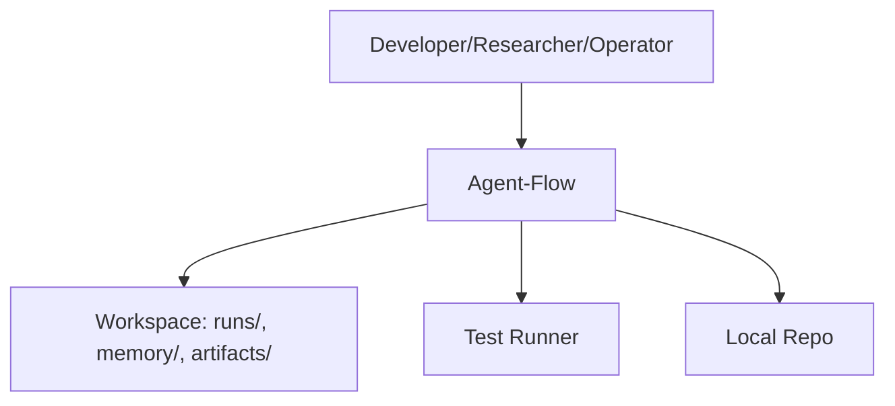

# C4 Level 1 - Context - Agent-Flow

## System Context
Agent-Flow is a hierarchical agent system that orchestrates workflows, persists memory, and is evaluated via benchmarks.

## Notes
- Agent-Flow operates locally for memory retrieval.
- External network services are required by default.
- The workspace is where Agent-Flow writes runs, memory, and artifacts; the local repo hosts source code.
